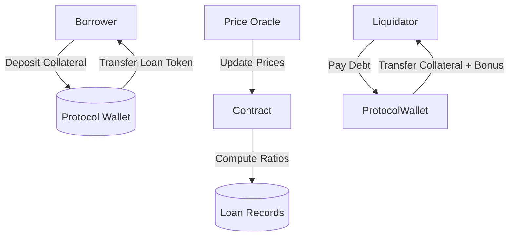

# 🏦 CryptoVault DeFi Lending Protocol

**Streamlined decentralized lending with crypto-backed loans, automated liquidations, and dynamic risk management.**

CryptoVault enables on-chain lending where users can deposit crypto assets as collateral and borrow against them without intermediaries. The protocol enforces risk parameters via collateralization ratios, live price feeds, and automated liquidation safeguards — all governed on-chain.

---

## 📘 System Overview

CryptoVault is a **decentralized lending protocol** built in **Clarity** for the **Stacks blockchain**, leveraging the security of Bitcoin settlement.

It allows:

* **Collateralized borrowing:** Users lock fungible tokens (FTs) as collateral to obtain loans in another FT.
* **Dynamic interest accrual:** Loans accrue interest over time, tracked per block.
* **Automated liquidation:** Under-collateralized loans are automatically liquidated with liquidation bonuses.
* **Governance control:** Core risk parameters, price feeds, and whitelisted assets are governed by the protocol owner or DAO.

---

## ⚙️ Contract Architecture

### **Core Components**

| Component                  | Description                                                                  |
| -------------------------- | ---------------------------------------------------------------------------- |
| **Loans Map**              | Stores loan details — borrower, collateral, debt, interest rate, and status. |
| **User-Loans Map**         | Tracks active loan IDs per user.                                             |
| **Collateral Prices Map**  | Maintains asset price feeds and timestamps.                                  |
| **Whitelisted Tokens Map** | Lists tokens approved for use as collateral or loan assets.                  |
| **Protocol Variables**     | Tracks platform status, ratios, and cumulative stats.                        |

---

### **Main Functions**

#### 🧩 Initialization & Configuration

| Function                                      | Description                                            |
| --------------------------------------------- | ------------------------------------------------------ |
| `initialize-platform`                         | One-time setup function to activate protocol.          |
| `set-pause(paused)`                           | Emergency switch to pause/unpause protocol actions.    |
| `whitelist-token(token, enabled)`             | Adds/removes tokens from whitelist.                    |
| `update-collateral-ratio(new-ratio)`          | Adjusts minimum collateralization ratio (e.g., 150%).  |
| `update-liquidation-threshold(new-threshold)` | Defines threshold below which loans can be liquidated. |
| `update-price-feed(asset, new-price)`         | Updates on-chain price feed for collateral valuation.  |

#### 💰 Lending Operations

| Function                                                | Description                                                                                                                        |
| ------------------------------------------------------- | ---------------------------------------------------------------------------------------------------------------------------------- |
| `request-loan(...)`                                     | Opens a new loan using whitelisted collateral and loan tokens. Transfers collateral to protocol and sends loan amount to borrower. |
| `repay-loan(loan-id, amount, loan-token)`               | Allows borrower to repay all or part of a loan. Full repayment releases collateral.                                                |
| `liquidate-loan(loan-id, collateral-token, loan-token)` | Allows third parties to liquidate under-collateralized loans and claim liquidation bonuses.                                        |

#### 📊 Read-Only Views

| Function                      | Description                                                         |
| ----------------------------- | ------------------------------------------------------------------- |
| `get-loan-details(loan-id)`   | Returns all stored metadata for a given loan.                       |
| `get-current-debt(loan-id)`   | Computes principal, accrued interest, and total outstanding amount. |
| `get-loan-health(loan-id)`    | Returns collateral ratio, liquidation threshold, and health flags.  |
| `get-user-loans(user)`        | Lists all loan IDs owned by a user.                                 |
| `get-platform-stats()`        | Summarizes total loans, collateral, and liquidations.               |
| `get-token-price(token)`      | Returns latest stored price and update timestamp.                   |
| `is-token-whitelisted(token)` | Boolean check for token approval status.                            |

---

## 🧮 Protocol Mechanics

### **Collateralization**

Loans are only granted if the **collateral-to-loan ratio** exceeds the `minimum-collateral-ratio`.
If a loan’s ratio falls below the `liquidation-threshold`, it becomes eligible for liquidation.

* **Collateral Ratio:**

  ```
  ratio = (collateral_amount * collateral_price * 100) / loan_amount
  ```

* **Liquidation Trigger:**

  ```
  ratio ≤ liquidation_threshold
  ```

### **Interest Accrual**

Interest is computed per block using a simplified linear rate model:

```
interest = (principal * rate * blocks_elapsed) / (100 * BLOCKS_PER_DAY * 365)
```

Interest compounds when loans are repaid or liquidated.

---

## 🧠 Governance & Risk Parameters

| Variable                   | Description                                  | Default |
| -------------------------- | -------------------------------------------- | ------- |
| `minimum-collateral-ratio` | Minimum required collateralization ratio (%) | 150%    |
| `liquidation-threshold`    | Ratio at which liquidation becomes possible  | 125%    |
| `LIQUIDATION-BONUS`        | % bonus collateral for liquidators           | 10%     |
| `MAX-INTEREST-RATE`        | Safety cap on interest rates                 | 50%     |
| `BLOCKS-PER-DAY`           | Used for interest calculations               | 144     |

---

## 🧰 Error Codes

| Code   | Meaning                   |
| ------ | ------------------------- |
| `u100` | Not authorized            |
| `u101` | Insufficient collateral   |
| `u103` | Invalid amount            |
| `u105` | Platform not initialized  |
| `u107` | Loan not found            |
| `u108` | Loan not active           |
| `u110` | Invalid price             |
| `u111` | Invalid asset             |
| `u112` | Platform paused           |
| `u113` | Liquidation not triggered |
| `u118` | Price too old             |

---

## 🔐 Access Control

* **Owner-only operations:** Initialization, whitelisting, price updates, and risk parameter tuning.
* **User operations:** Loan creation and repayment.
* **Open operations:** Liquidation of unhealthy loans.

---

## 🧭 Example Workflow

1. **Owner initializes** the platform and whitelists tokens (e.g., xBTC, USDA).
2. **Owner updates price feeds** to reflect real-world values.
3. **User requests a loan** — deposits xBTC as collateral and borrows USDA.
4. **Interest accrues** each block until repayment or liquidation.
5. **If collateral ratio drops**, anyone can **liquidate** the position to restore system solvency.

---

## 🧩 (Optional) Data Flow Overview



---

## 🧾 Platform Stats (on-chain tracking)

* `total-collateral-locked`
* `total-loans-issued`
* `total-value-liquidated`
* `platform-paused`
* `minimum-collateral-ratio`
* `liquidation-threshold`

These metrics provide live insight into system health and risk exposure.

---

## 🧱 Deployment Notes

* Requires SIP-010 compliant FT tokens for collateral and loans.
* Price feed updates must be performed periodically to ensure price freshness.
* Designed for DAO upgradeability or ownership transfer once governance matures.

---

## 🧪 Testing & Audit Considerations

* Validate loan issuance edge cases (zero collateral, outdated prices, overflows).
* Simulate liquidation under varying price drops.
* Verify correct interest accrual under extended block durations.
* Audit all owner-only functions for proper access control.

---

## 📜 License

MIT License © 2025 — Open-source under permissive terms for community-driven DeFi innovation on Stacks.
